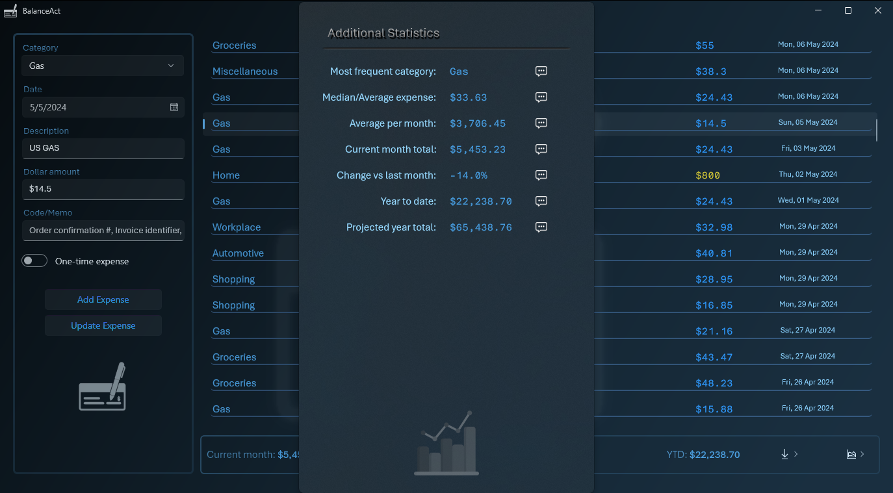

# 💻 WinUI3 - Balance Act

## 📦 Description

- A simple expense item tracking application with statistics.
- This source also contains plenty of tips and tricks for any [WinUI 3](https://github.com/Microsoft/microsoft-ui-xaml) application.
- Don't forget to give a ⭐ if you find any of my code helpful or educational.

**Dependencies**

| Assembly | Version |
| ---- | ---- |
| .NET Core | 8.0.13 |
| Microsoft.WindowsAppSDK | 1.6.250228001 |
| Microsoft.Windows.SDK.BuildTools | 10.0.26100.1742 |
| Microsoft.Xaml.Behaviors.WinUI.Managed | 2.0.9 |
| Microsoft.Extensions.DependencyInjection | 8.0.0 |
| CommunityToolkit.Mvvm | 8.2.2 |
| CommunityToolkit.WinUI | 7.1.2 |
| CommunityToolkit.WinUI.UI.Behaviors | 7.1.2 |
| Newtonsoft.Json | 13.0.3 |

> Real-time stats and projections

> Intelligent importing (supports most CSV banking formats)

> App-aware debugger attachment

> Home-made drop shadow effects (code-behind version & XAML version)

## 📝 v1.0.0.2 - March 2025
* General enhancement pass with clean up.
* Updated core frameworks.

## 📝 v1.0.0.1 - June 2024
* Added search feature.

 ## 📝 v1.0.0.0 - May 2024
* Initial release.

## 🎛️ Usage
* This application was intended to be run unpackaged, but I have added checks for running in packaged format as well.
* You will need at least [Visual Studio 2022](https://visualstudio.microsoft.com/downloads/) with the **.NET Desktop Development** and **WinUI Application Development** workloads installed to build and debug this solution.
* I've added an example of a gradient **SystemBackdrop**, but there is also a [Desktop Acrylic Controller](https://learn.microsoft.com/en-us/windows/windows-app-sdk/api/winrt/microsoft.ui.composition.systembackdrops.desktopacryliccontroller?view=windows-app-sdk-1.5) for the main window.

## 🧾 License/Warranty
* Permission is hereby granted, free of charge, to any person obtaining a copy of this software and associated documentation files (the "Software"), to deal in the Software without restriction, including without limitation the rights to use, copy, modify, merge, publish and distribute copies of the Software, and to permit persons to whom the Software is furnished to do so, subject to the following conditions: The above copyright notice and this permission notice shall be included in all copies or substantial portions of the Software.
* The software is provided "as is", without warranty of any kind, express or implied, including but not limited to the warranties of merchantability, fitness for a particular purpose and noninfringement. In no event shall the author or copyright holder be liable for any claim, damages or other liability, whether in an action of contract, tort or otherwise, arising from, out of or in connection with the software or the use or other dealings in the software.
* Copyright © 2023-2024. All rights reserved.

## 📋 Proofing
* This application was compiled and tested using *VisualStudio* 2022 on *Windows 10* versions **22H2**, **21H2** and **21H1**.

